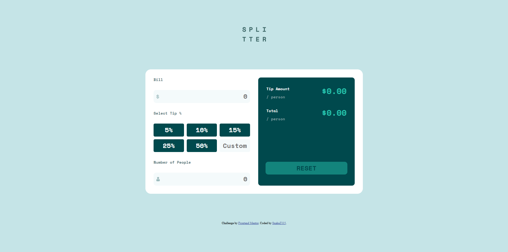

# Frontend Mentor - Tip calculator app solution

This is a solution to the [Tip calculator app challenge on Frontend Mentor](https://www.frontendmentor.io/challenges/tip-calculator-app-ugJNGbJUX). Frontend Mentor challenges help you improve your coding skills by building realistic projects.

## Table of contents

- [Overview](#overview)
  - [The challenge](#the-challenge)
  - [Screenshot](#screenshot)
  - [Links](#links)
- [My process](#my-process)
  - [Built with](#built-with)
  - [What I learned](#what-i-learned)
  - [Continued development](#continued-development)
  - [Useful resources](#useful-resources)
- [Author](#author)

## Overview

### The challenge

Users should be able to:

- View the optimal layout for the app depending on their device's screen size
- See hover states for all interactive elements on the page
- Calculate the correct tip and total cost of the bill per person

### Screenshot



### Links

- Solution URL: [FrontEnd Mentor](https://www.frontendmentor.io/solutions/tip-calculator-app-dRm3lJZSFf)
- Live Site URL: [Netlify](https://snazzy-hamster-c62238.netlify.app)

## My process

### Built with

- Semantic HTML5 markup
- CSS custom properties
- Flexbox
- CSS Grid
- Vanilla JavaScript
- Desktop-first workflow

### What I learned

This is my first project using a lot of JavaScript. I really took my time on this project because I needed to know how to manage all the values, inputs, etc.
I'm really proud of the "tip-buttons" section. When I was programming that, I needed to know which button was the last selected. At the beginning I use 2 variables:
"lastClicked" and "SelectedTips" but I was able to optimize it using only 1 varible. Here's the code:

```js
tipsButtons.forEach(tipButton => {
    tipButton.addEventListener('click', (event) => {
        event.preventDefault();
        selectedTip = document.querySelector('.selected');

        if(selectedTip) {
            if(tipButton === selectedTip) {
                tipButton.classList.remove('selected');
            } else {
                selectedTip.classList.remove('selected');
                tipButton.classList.add('selected');
            }
        } else {
            tipButton.classList.add('selected');
        }

        tip = tipButton.value;
        calculate();
    
    });
});
```
Basically, I search for a "selectedTip". If I find one, there's another condition: if the tip I recently pressed is the same one that I found, I remove the "selected" class from "tipButton". If not, I remove the class from the "selectedTip" and I add the same class to the "tipButton" (tipButton is the button I recently pressed). If there isn't a "selectedTip", I just add the "selected" class to the "tipButton".

I don't know if there's another way to do it but I did it this way and I am very proud of it.

### Continued development

I wanna keep practicing JS. I really like to add interactivity to websites. In future project, I'll try to optimize as much as I can.

### Useful resources

- [w3school](https://www.w3schools.com) - This is great website. This one helped me a lot with CSS things such as padding, margin, etc.

## Author

- Frontend Mentor - [@SnakeZ115](https://www.frontendmentor.io/profile/SnakeZ115)

